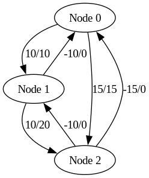

# Max-Flow Algorithm Visualizer



An interactive implementation of the Edmonds-Karp max-flow algorithm with dual visualization modes (SFML and Graphviz), designed for both educational and analytical purposes.

## Table of Contents
- [Features](#features)
- [Prerequisites](#prerequisites)
- [Installation](#installation)
- [Building the Project](#building-the-project)
  - [Method 1: Direct Compilation](#method-1-direct-compilation)
  - [Method 2: CMake Build](#method-2-cmake-build-recommended)
- [Usage](#usage)
  - [Interactive Controls](#interactive-controls)
  - [Output Files](#output-files)
- [Project Structure](#project-structure)
- [Technical Details](#technical-details)
- [License](#license)

## Features

- **Algorithm Visualization**:
  - Step-by-step rendering of augmenting paths
  - Real-time residual capacity updates
  - Flow accumulation tracking

- **Multiple Output Modes**:
  - Interactive SFML visualization with path animation
  - Publication-quality Graphviz diagrams

- **Cross-Platform**:
  - Supports Linux, Windows, and macOS
  - CMake and direct compilation options

## Prerequisites

| Platform       | Dependencies                                                                 |
|----------------|-----------------------------------------------------------------------------|
| **Linux**      | `g++` ≥ 9.0, `libsfml-dev`, `graphviz`, `cmake`                            |
| **macOS**      | `clang++` (Xcode), `sfml`, `graphviz`, `cmake` (via Homebrew)              |
| **Windows**    | MSVC 2019+, vcpkg (`sfml`, `graphviz`)                                     |

## Installation

### Linux (Debian/Ubuntu)
```bash
sudo apt update && sudo apt install g++ libsfml-dev graphviz cmake
```

### macOS (Homebrew)
```bash
brew install sfml graphviz cmake
```

### Windows (vcpkg)
```powershell
vcpkg install sfml graphviz --triplet x64-windows
```

## Building the Project

### Method 1: Direct Compilation

**Static Diagram Generation:**
```bash
g++ src/main.cpp src/graph.cpp -o nflox
./nflox
dot -Tpng graph.dot -o graph.png
```

**Interactive Visualizer:**
```bash
g++ src/main.cpp src/graph.cpp src/visualizer.cpp -o nflowx -lsfml-graphics -lsfml-window -lsfml-system
./nflowx
```

### Method 2: CMake Build (Recommended)
```bash
mkdir build && cd build
cmake .. -DCMAKE_BUILD_TYPE=Release
make -j4
```

**Run Executables:**
```bash
./nflowx  # Interactive visualizer
./nflox   # Static diagram generator
```

## Usage

**Input Specification:**
```
Enter number of nodes: 4
Enter number of edges: 5
Enter each edge as: from to capacity
0 1 20
0 2 10
1 2 5
1 3 10
2 3 20
Enter source: 0
Enter sink: 3
```

### Interactive Controls:

→ Right Arrow: Next augmentation step  
← Left Arrow: Previous step  
Space: Toggle final max-flow view  
Esc: Exit visualization

### Output Files:

- `graph.dot`: Graphviz source file
- `graph.png`: Rendered flow network diagram

## Project Structure

```
src/
├── main.cpp            # CLI interface and core workflow
├── graph.h             # Graph class declaration
├── graph.cpp           # Edmonds-Karp implementation
├── visualizer.h        # SFML visualization interface
└── visualizer.cpp      # Rendering and interaction logic
```

## Technical Details

**Algorithm:**

- Implements Edmonds-Karp (BFS-based Ford-Fulkerson)
- O(VE²) time complexity
- Maintains complete residual graph state

**Visualization:**

- SFML 2.5 for hardware-accelerated rendering
- Graphviz for automatic graph layout
- Circular node positioning algorithm
